# Monitoring Cyber Attacks on Azure VM using Azure Sentinel

## Overview

This project demonstrates the implementation of Microsoft's Azure Sentinel SIEM to monitor and analyze cyber attacks on an Azure Virtual Machine (VM). By deploying a vulnerable VM and utilizing a custom PowerShell script, the project captures data on attempted Remote Desktop Protocol (RDP) logs. This data, along with geolocation information obtained from a third-party API, is logged in Azure Sentinel for analysis and visualization.


## Table of Contents

1. [Introduction](#introduction)
2. [Setup](#setup)
3. [Conclusion](#conclusion)

## Introduction

Cyber attacks targeting cloud resources pose significant security risks for organizations. This project aims to enhance security measures by leveraging Azure Sentinel to monitor attempted RDP logons on an Azure VM. Through the analysis of geolocation data, organizations can gain valuable insights into the geographical distribution of cyber attacks.

## Setup

### Basics

- Go to `portal.azure.com`
- Search for "virtual machines" 
- Create > Azure virtual machine
#### Project details
- Create new resource group
> A resource group is a collection of resources that share the same lifecycle, permissions, and policies.
#### Instance details
- Name your VM
- Select a recommended region ((US) East US 2)
- Availability options: No infrastructure redundancy required
- Security type: Standard
- Image: Windows 10 Pro, version 21H2 - x62 Gen2
- VM Architecture: x64
- Size: Default is okay (Standard_D2s_v3 – 2vcpus, 8 GiB memory)
#### Administrator account
- Create a username and password for virtual machine
> IMPORTANT NOTE: These credentials will be used to log into the virtual machine (Keep them handy)
#### Inbound port rules
- Public inbound ports: Allow RDP (3389)
#### Licensing
- Confirm licensing 
- Select **Next : Disks >**

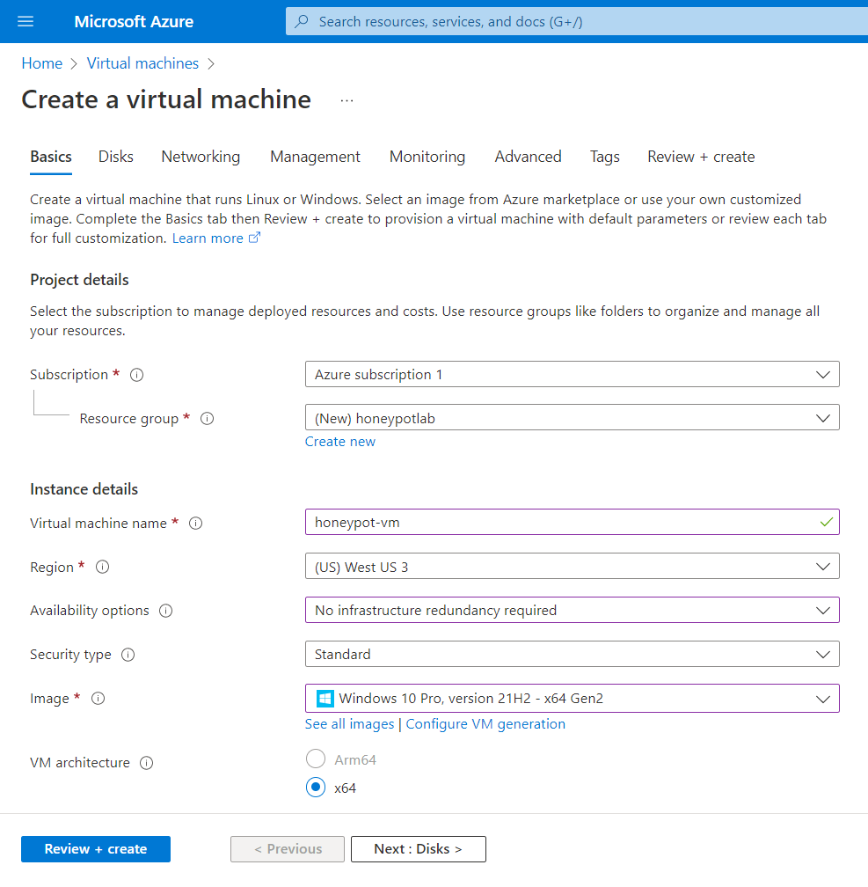

### Disks 
- Leave all defaults
- Select **Next : Networking >**

### Networking
#### Network interface
- NIC network security group: Advanced > Create new
> A network security group contains security rules that allow or deny inbound network traffic to, or outbound network traffic from, the virtual machine. In other words, security rules management.
- Remove Inbound rules (1000: default-allow-rdp) by clicking three dots
- Add an inbound rule
- Destination port ranges: * (wildcard for anything)
- Protocol: Any
- Action: Allow
- Priority: 100 (low)
- Name: Anything (ALLOW_ALL_INBOUND)
- Select **Review + create**

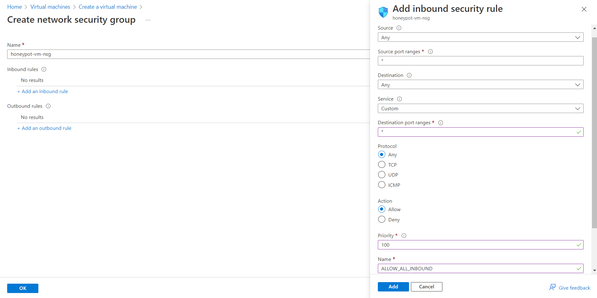

> Configuring the firewall to allow traffic from anywhere will make the VM easily discoverable.

## Step 3: Create a Log Analytics Workspace
- Search for "Log analytics workspaces"
- Select **Create Log Analytics workspace**
- Put it in the same resource group as VM (honeypotlab)
- Give it a desired name (honeypot-log)
- Add to same region (East US 2)
- Select **Review + create**

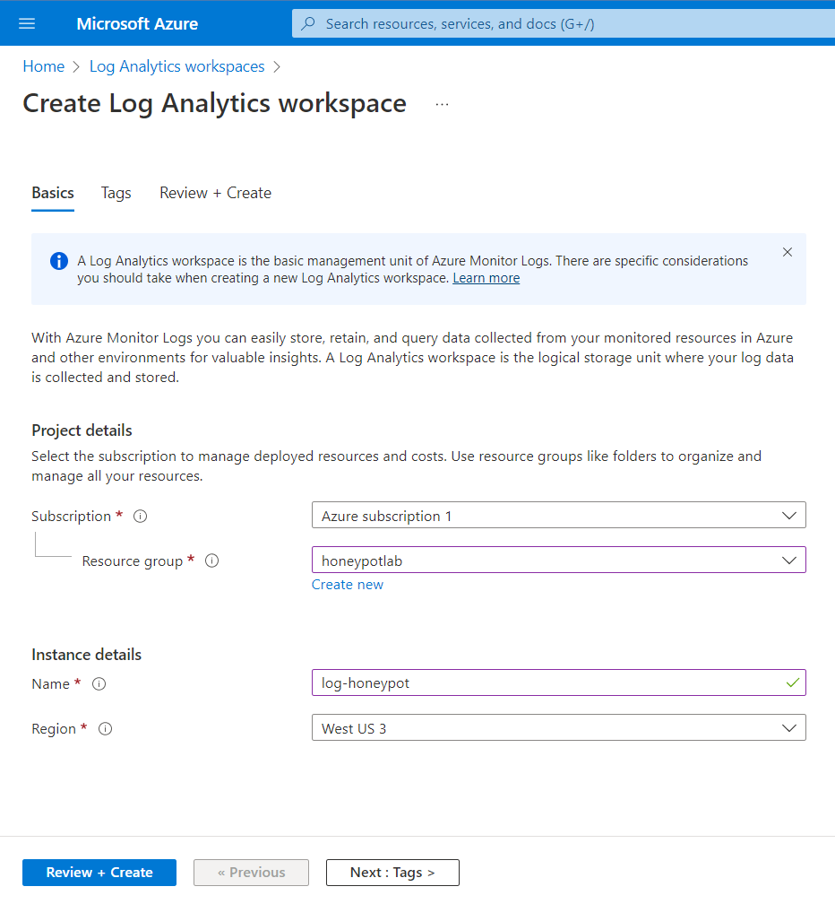

> The Windows Event Viewer logs will be ingested into Log Analytics workspaces in addition to custom logs with geographic data to map attacker locations.

## Step 4: Configure Microsoft Defender for Cloud
- Search for "Microsoft Defender for Cloud"
- Scroll down to "Environment settings" > subscription name > log analytics workspace name (log-honeypot)

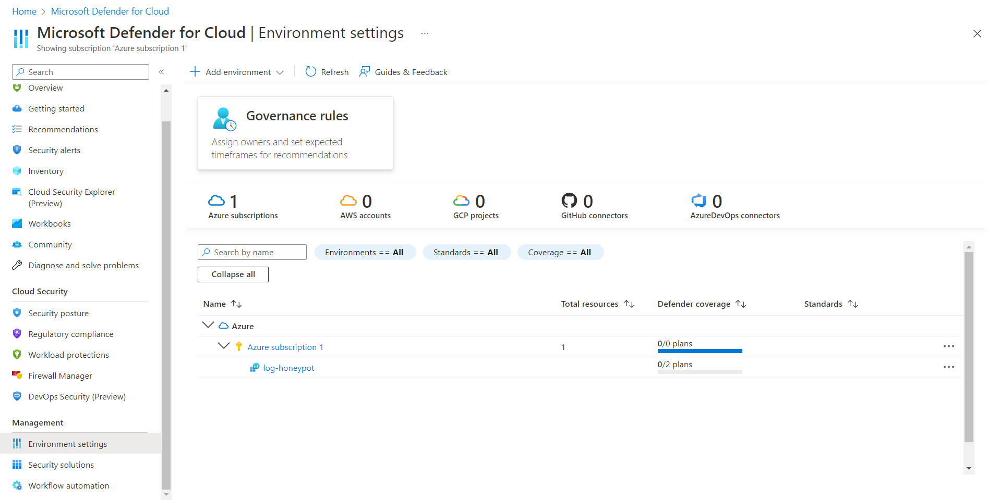

#### Settings | Defender plans
- Cloud Security Posture Management: ON
- Servers: ON
- SQL servers on machines: OFF
- Hit **Save**


#### Settings | Data collection
- Select "All Events" 
- Hit **Save**

## Step 5: Connect Log Analytics Workspace to Virtual Machine
- Search for "Log Analytics workspaces"
- Select workspace name  > "Virtual machines" > virtual machine name 
- Click **Connect**

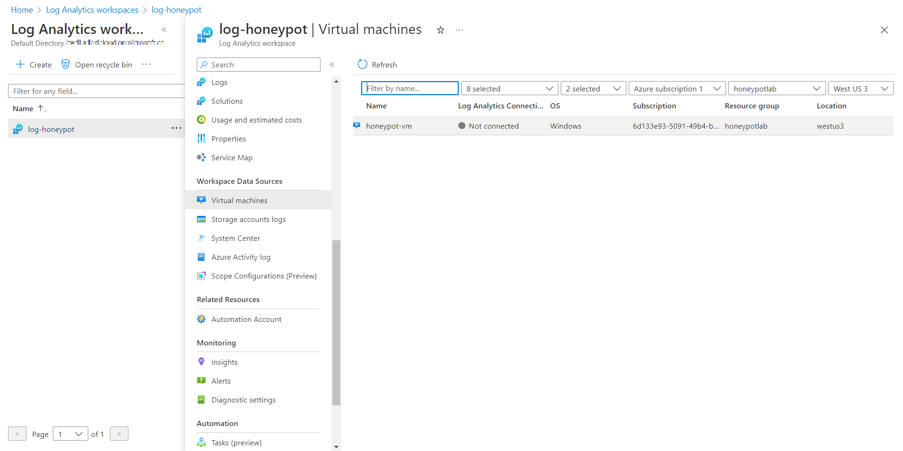

## Step 6: Configure Microsoft Sentinel
- Search for "Microsoft Sentinel"
- Click **Create Microsoft Sentinel**
- Select Log Analytics workspace name 
- Click **Add**

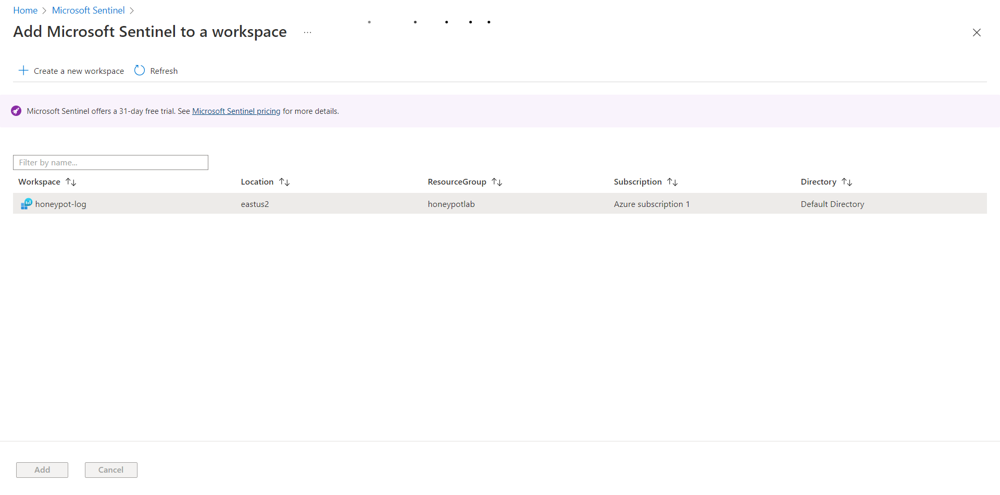

## Step 7: Disable the Firewall in Virtual Machine
- Go to Virtual Machines and find the honeypot VM 
- By clicking on the VM copy the IP address
- Log into the VM via Remote Desktop Protocol (RDP) with credentials from step 2
- Accept Certificate warning
- Select NO for all **Choose privacy settings for your device**
- Click **Start** and search for "wf.msc" (Windows Defender Firewall)
- Click "Windows Defender Firewall Properties"
- Turn Firewall State OFF for **Domain Profile** **Private Profile** and **Public Profile**
- Hit **Apply** and **Ok**
- Ping VM via Host's command line to make sure it is reachable `ping -t <VM IP>`

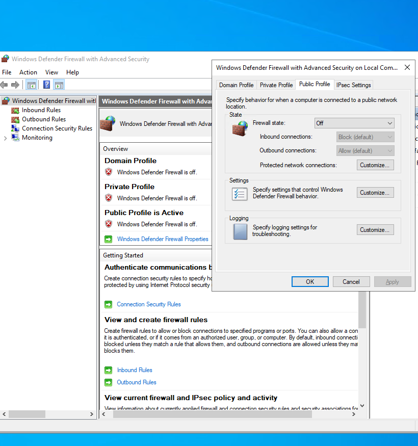

## Step 8: Scripting the Security Log Exporter
- In VM open Powershell ISE
- Set up Edge without signing in
- Copy [Powershell script](https://github.com/joshmadakor1/Sentinel-Lab/blob/main/Custom_Security_Log_Exporter.ps1) into VM's Powershell (Written by Josh Madakor)
- Select **New Script** in Powershell ISE and paste script
- Save to Desktop and give it a name (Log_Exporter)

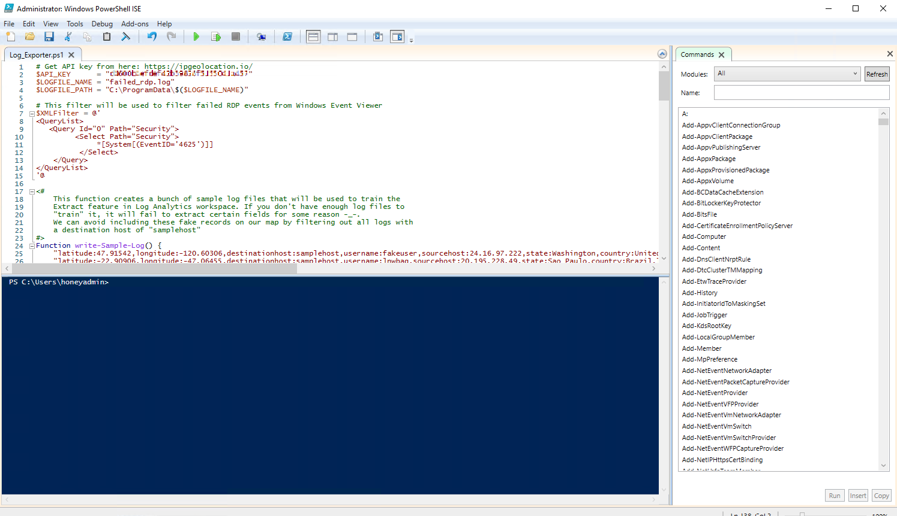

- Make an account with [Free IP Geolocation API and Accurate IP Lookup Database](https://ipgeolocation.io/)
> This account is free for 1000 API calls per day. Paying 15.00$ will allow 150,000 API calls per month.
- Copy API key once logged in and paste into script line 2: `$API_KEY = "<API key>"`
- Hit **Save**
- Run the PowerShell ISE script (Green play button) in the virtual machine to continuously produce log data


> The script will export data from the Windows Event Viewer to then import into the IP Geolocation service. It will then extract the latitude and longitude and then create a new log called failed_rdp.log in the following location: C:\ProgramData\failed_rdp.log

## Step 9: Create Custom Log in Log Analytics Workspace
- Create a custom log to import the additional data from the IP Geolocation service into Azure Sentinel
- Search "Run" in VM and type "C:\ProgramData"
- Open file named "failed_rdp" hit **CTRL + A** to select all and **CTRL + C** to copy selection
- Open notepad on Host PC and paste contents
- Save to desktop as "failed_rdp.log"
- In Azure go to Log Analytics Workspaces > Log Analytics workspace name > Tables > **Create New custom log (MMA  based)**
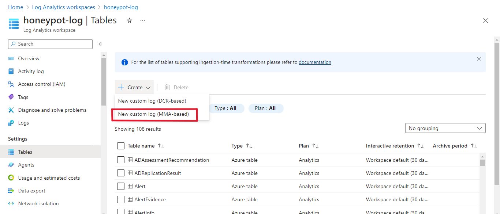
#### Sample
- Select Sample log saved to Desktop (failed_rdp.log) and hit **Next**
#### Record delimiter
- Review sample logs in Record delimiter and hit **Next** 
#### Collection paths
- Type > Windows
- Path > "C:\ProgramData\failed_rdp.log"
#### Details
- Give the custom log a name and provide description (FAILED_RDP_WITH_GEO) and hit **Next**
- Hit **Create**

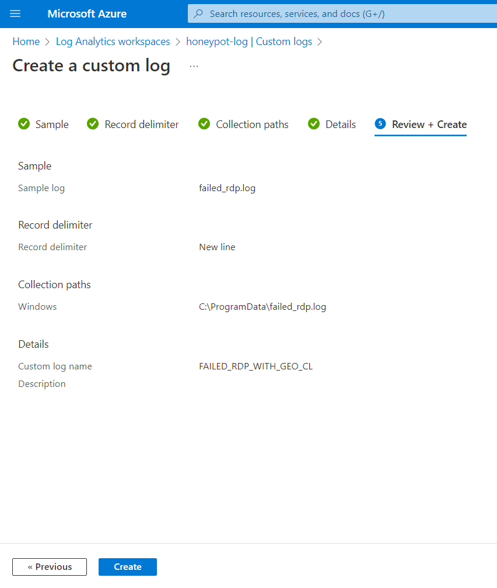

## Step 10: Query the Custom Log
- In Log Analytics Workspaces go to the created workspace (honeypot-log) > Logs
- Run a query to see the available data (FAILED_RDP_WITH_GEO_CL)
> May take some time for Azure to sync VM and Log Analytics

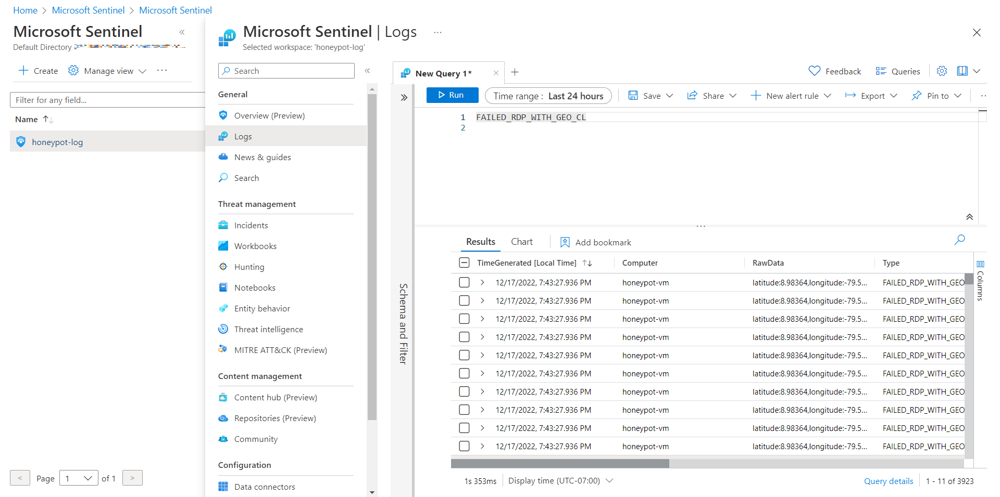

## Step 11: Map Data in Microsoft Sentinel
- Go to Microsoft Sentinel to see the Overview page and available events
- Click on **Workbooks** and **Add workbook** then click **Edit**
- Remove default widgets (Three dots > Remove)
- Click **Add > Add query** 
- Copy/Paste the following query into the query window and **Run Query**
  
```KQL
// Extracting fields from the custom log format FAILED_RDP_WITH_GEO_CL
FAILED_RDP_WITH_GEO_CL 
| extend username = extract(@"username:([^,]+)", 1, RawData), // Extract username from RawData field
         timestamp = extract(@"timestamp:([^,]+)", 1, RawData), // Extract timestamp from RawData field
         latitude = extract(@"latitude:([^,]+)", 1, RawData), // Extract latitude from RawData field
         longitude = extract(@"longitude:([^,]+)", 1, RawData), // Extract longitude from RawData field
         sourcehost = extract(@"sourcehost:([^,]+)", 1, RawData), // Extract source host from RawData field
         state = extract(@"state:([^,]+)", 1, RawData), // Extract state from RawData field
         label = extract(@"label:([^,]+)", 1, RawData), // Extract label from RawData field
         destination = extract(@"destinationhost:([^,]+)", 1, RawData), // Extract destination host from RawData field
         country = extract(@"country:([^,]+)", 1, RawData) // Extract country from RawData field
| where destination != "samplehost" // Filter out events with destination host "samplehost"
| where sourcehost != "" // Filter out events with empty source host
| summarize event_count=count() by latitude, longitude, sourcehost, label, destination, country // Summarize event count by latitude, longitude, source host, label, destination host, and country
```
- The result should look something like this
  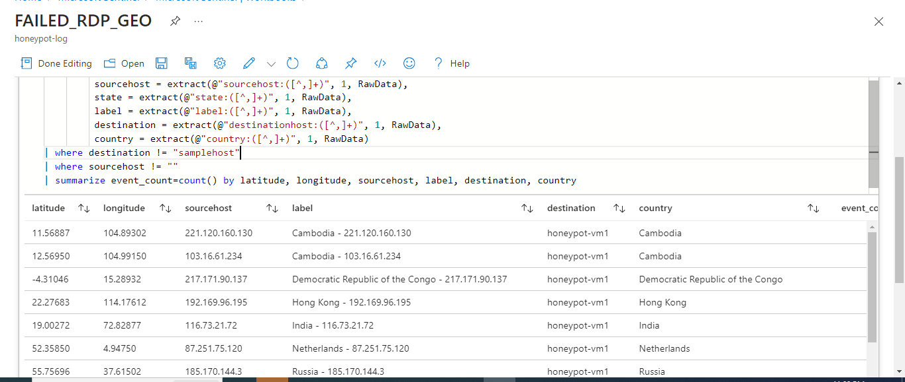

- Once results come up click the **Visualization** dropdown menu and select **Map**
- Select **Map Settings** for additional configuration
#### Layout Settings
- **Location info using** > Latitude/Longitude
- **Latitude** > latitude_CF
- **Longitude** > longitude_CF
- **Size by** > event_count
#### Color Settings
- **Coloring Type:** Heatmap 
- **Color by** > event_count
- **Aggregation for color** > Sum of values
- **Color palette** > Green to Red
#### Metric Settings
- **Metric Label** > label_CF
- **Metric Value** > event_count
- Select **Apply** button and **Save and Close**
- Save as "Failed RDP World Map" in the same region and under the resource group (honeypotlab)
- Continue to refresh map to display additional incoming failed RDP attacks
> NOTE: The map will only display Event Viewer's failed RDP attempts and not all the other attacks the VM may be receiving.

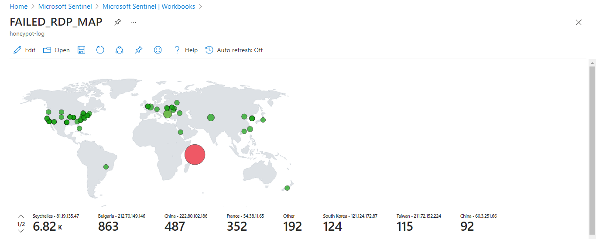

> Event Viewer Displaying Failed RDP logon attemps. EventID 4625

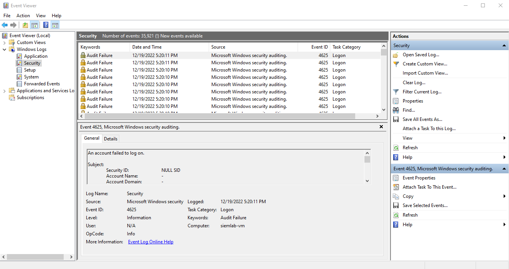

> Custom Powershell script parsing data from 3rd party API

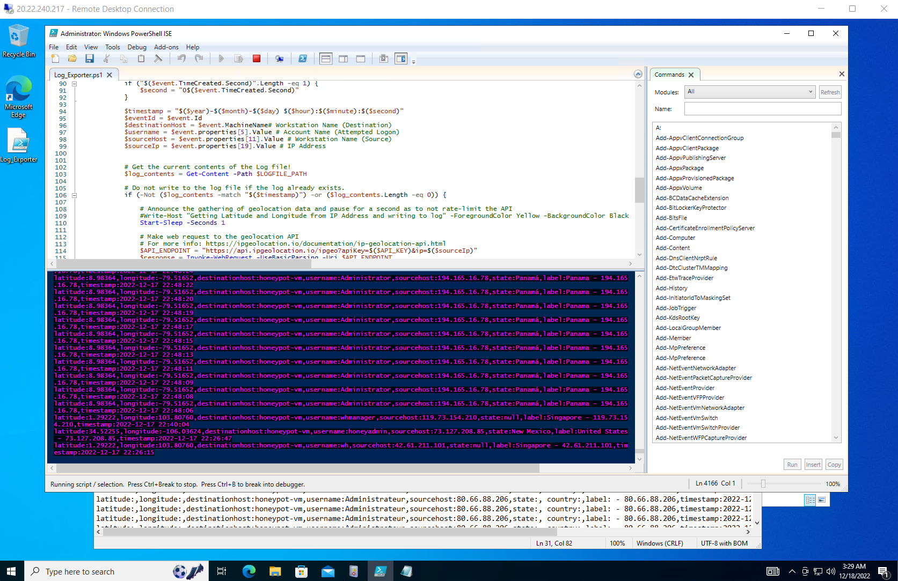

## Conclusion
By implementing this solution, organizations can proactively monitor and respond to cyber attacks targeting their Azure VMs. Microsoft Azure Sentinel provides powerful capabilities for security analytics and threat detection, enabling organizations to strengthen their defense against evolving threats


